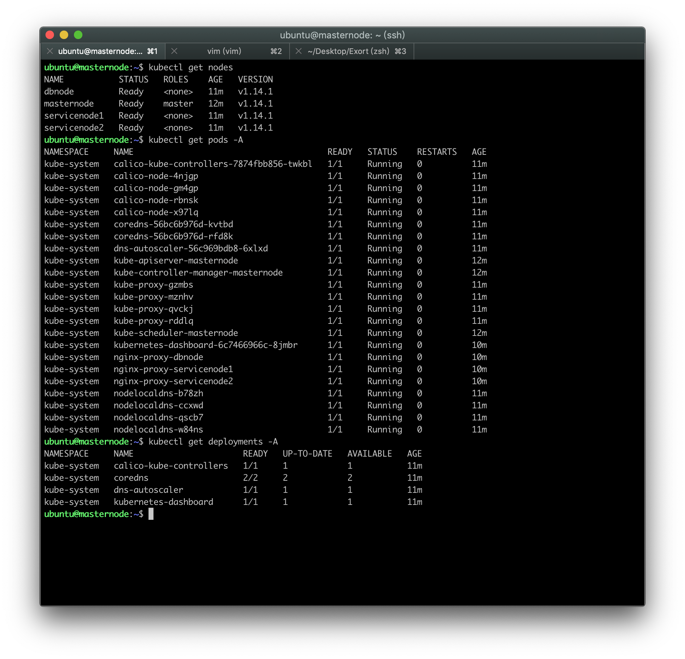

# 在服务器上部署k8s

> 部署k8s唯一的障碍就是防火墙。

我们采用的是[kubespray](https://github.com/kubernetes-sigs/kubespray)来进行自动化的部署，但是在镜像拉取过程中会遇到无法拉取的错误。

为了成功的在服务器上部署k8s，以下是目前找到的三种较为可靠的方式：
1. 手动在国内源中拉取镜像，再逐个打上标签，推送到各个节点上。
2. 在服务器上使用VPS代理，使得kubespray能够在部署过程中能够拉取到需要的镜像。
3. 使用192.168.2.24下提供的离线安装包。

## 方式一：手动拉取镜像
参考：
1. https://github.com/tx19980520/new-tech-stack/blob/master/k8s/kubeadm%20install.md

## 方式二：VPS代理
参考：
1. https://github.com/Shadowsocks-Wiki/shadowsocks/blob/master/6-linux-setup-guide-cn.md
2. http://godsing.top/2018/04/13/Linux%E4%B8%8Bshadowsocks%E5%90%84%E7%A7%8D%E4%BB%A3%E7%90%86%E6%96%B9%E5%BC%8F%E6%80%BB%E7%BB%93/
3. http://unodba.github.io/2015/06/04/sys-linux-proxy/
4. https://kubernetes.feisky.xyz/bu-shu-pei-zhi/cluster/kubespray

## 方式三：离线安装包
参考：
1. https://se-cloud.gitbook.io/openstack/
2. https://veiasai.github.io/2019/04/17/kubespray-%E8%B6%85%E5%BF%AB%E4%B9%90%E7%9A%84offline%E5%AE%89%E8%A3%85k8s/

步骤：
1. 拉取所需资源
```
	wget 10.0.0.26/kube-1.14.1/kube-1.14.1.tar
	wget 10.0.0.26/kube-1.14.1/kubespray-2.10.0.tar.gz
	wget 10.0.0.26/kube-1.14.1/releases/calicoctl
	wget 10.0.0.26/kube-1.14.1/releases/hyperkube
	wget 10.0.0.26/kube-1.14.1/releases/kubeadm
	wget 10.0.0.26/kube-1.14.1/releases/cni-plugins-amd64-v0.6.0.tgz
```
2. 配置ssh，安装docker，分发资源
3. 去掉`all.yml`中的proxy配置，注释掉`cluster.yml`中的container-engine和download部分
```
	- hosts: k8s-cluster:etcd:calico-rr
	any_errors_fatal: "{{ any_errors_fatal | default(true) }}"
	roles:
		- { role: kubespray-defaults}
		- { role: kubernetes/preinstall, tags: preinstall }
		# - { role: "container-engine", tags: "container-engine", when: deploy_container_engine|default(true) }
		# - { role: download, tags: download, when: "not skip_downloads" }
	environment: "{{proxy_env}}"
```
4. 调整`hosts.ini`，指向生产环境机器
5. 执行部署
`ansible-playbook -i inventory/mycluster/hosts.ini --become --become-user=root cluster.yml`

我将完整的部署步骤写入了脚本文件，文件位于[script](../script)目录下

可能会出现的问题：

1. The connection to the server localhost:8080 was refused

参考github上kubernetes的issue(https://github.com/kubernetes/kubernetes/issues/44665)
```
	sudo cp /etc/kubernetes/admin.conf $HOME/
	sudo chown $(id -u):$(id -g) $HOME/admin.conf
	export KUBECONFIG=$HOME/admin.conf
```

## 最终结果

