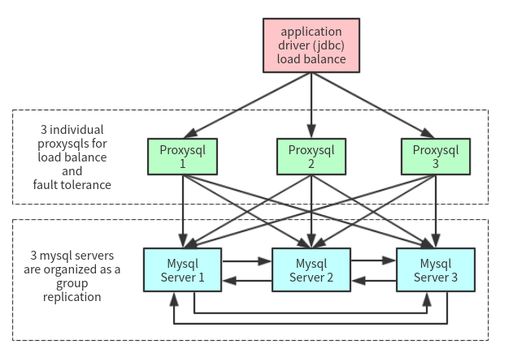

# 架构设计

## 开发

|模块|优先级|说明|技术选型|
|--|--|--|--|
|Web客户端|高|浏览器前端|Vue.js + iView|
|前端服务器&文件服务器|高|向客户端返回页面和文件|Spring boot|
|API服务器|高|向客户端和前端服务器提供服务|Spring boot|
|登录管理|高|提供用户的认证授权功能|Spring boot|
|权限管理|高|提供用户的权限管理功能|Spring boot|
|用户管理|高|提供用户的信息和状态管理功能|Spring boot|
|社团管理|高|提供社团创建、审核、信息查询和修改功能|Spring boot|
|成员管理|高|提供社团组织架构和成员管理功能|Spring boot|
|文章管理|中|提供社团编辑、发布文章等功能|Spring boot|
|活动管理|中|提供社团编辑、发布活动等功能|Spring boot|
|评论管理|低|提供评论功能|Spring boot|
|动态管理|低|提供订阅、推送、查看动态功能|Spring boot|
|资产管理|低|提供社团内部资产管理功能|Spring boot|

## 运维

1. 容器编排、部署工具(k8s)
2. 数据库(mysql+proxysql, mongodb)
   
3. HTTP网关(nginx)
4. 服务网格(Istio)
5. CI/CD(drone)
