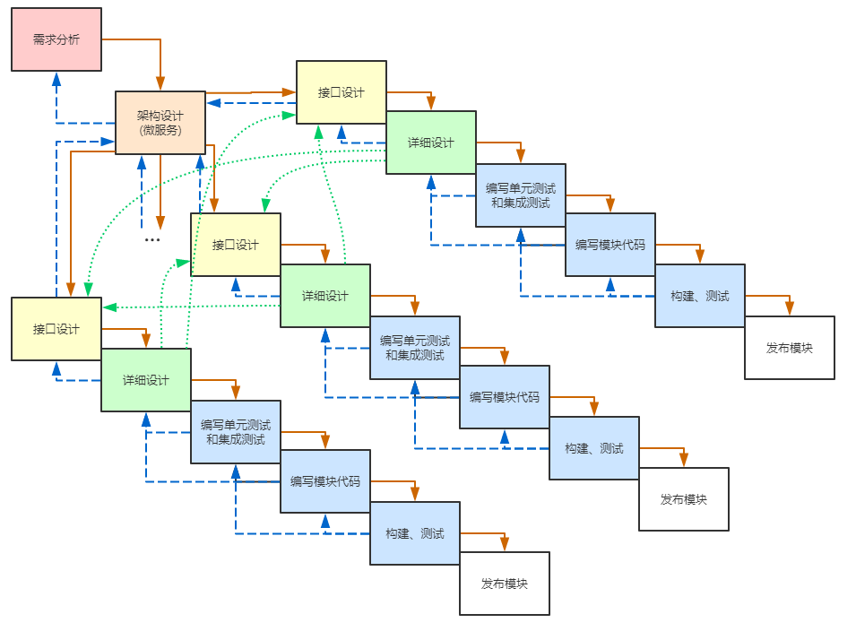
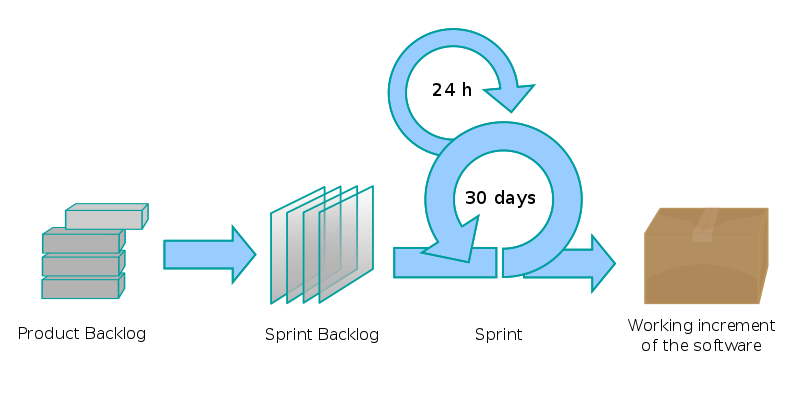

# Exort 项目管理说明 <span id="0" />
## 1 前言 <span id="1" />

按大作业要求我们应该采用敏捷开发的方式(具体为其中的Scrum方法)。
[推荐阅读](https://www.cnblogs.com/xinz/archive/2011/11/27/2265425.html)

> 敏捷 (Agile) 是一股思潮, 它包括了好几种软件开发的方法论 (methodology);
> 这些方法论又是建立在许多业界证明行之有效的最佳实践方法 (best practices) 上面的。
> [1](https://www.cnblogs.com/xinz/archive/2011/04/27/2031118.html)
> 

Scrum要求团队
- **Self-managing** 团队成员需要自主挑选任务，sprint结束后要总结不足提出改进，并自己能实施这些改进。
- **Self-organizing** 每个团队成员共同对项目负责，当其他人落后了需要帮助他改进。
- **Cross-functional** 团队成员要有全面的能力，包括设计、编码、测试等

编写这个文档的目的就是帮助团队达成上述这些很高的要求。

## 2 敏捷软件开发宣言 <span id="2" />

> 我们一直在实践中探寻更好的软件开发方法，身体力行的同时也帮助他人。
> 由此我们建立了如下价值观：
> - **个体和互动** 高于 **流程和工具**
> - **工作的软件** 高于 **详尽的文档**
> - **客户合作** 高于 **合同谈判**
> - **响应变化** 高于 **遵循计划**
>
> 也就是说，尽管右项有其价值，我们更重视左项的价值。

要注意《敏捷宣言》的最后一句不能忽视，更重视左项并不代表轻视右项。

## 3 软件开发流程 <span id="3" />

敏捷开发更注重团队成员之间的沟通，但依靠流程去指导我们前进的方向依然是必要的。

我们基于 **Scrum/Sprint** 开发流程，结合瀑布模型和测试驱动，提出适合我们的开发流程。

### 3.1 该项目 Waterfall 及各步骤产出 <span id="3.1" />



由于我们预先就决定了要采用微服务架构，因此在架构设计之后，每个模块(微服务)进行独立的设计和开发。

考虑到模块间的依赖，我们允许每个模块在详细设计之后修改所依赖的模块的接口设计，这过程要通过项目成员间的积极沟通来达成。例如若某个被要求修改接口设计的模块正在进行详细设计步骤，那其负责人可以暂停当前的工作，在接口设计完成后基于新的接口设计继续他的工作。

另外，借助于 _CI/CD_ 工具，流程中编写测试、编写代码、构建测试三个步骤的循环可以由一个项目成员自助自动进行。

各步骤产出如下表，详见 [`4.3 各步骤产出`](#4.3)

| 步骤 | 产出 |
|-|-|
| 需求分析 | 用例图 |
| 架构设计 | 架构图、技术选型 |
| (各个模块)接口设计 | 接口描述文档 |
| (各个模块)详细设计 | 类图、流程图、时序图等对模块具体实现的描述 |
| (各个模块)编写单元测试和集成测试 | 测试代码 |
| (各个模块)编写代码 | 实现代码 |
| (各个模块)构建、测试 | 可执行文件、CI/CD平台上测试通过状态 |
| (各个模块)发布 | 运行实例 |

### 3.2 应用 Scrum 后的流程 <span id="3.2" />



1. 按照依赖关系将 Waterfall 图中的当前能做的步骤加入 _Product Backlog_
2. ScrumMaster 或 _Product Backlog_ 创建者对其进行详细描述后加入 _Sprint backlog_
3. 项目成员认领 _Sprint backlog_ 并开始 sprint
4. 项目成员提交成果
5. 评审通过后完成 sprint
6. 项目成员完成一个步骤后，参照 Waterfall 图将下一步骤加入 _Product Backlog_
7. 重复 2~6，直至全部完成

## 4 规范/流程 <span id="4" />

我们的团队并没有过长期的共同合作，因此彼此之间没有心照不宣的约定，接下来详细罗列团队成员需要遵循的规范和流程。

### 4.1 软件开发流程 <span id="4.1" />

我们使用 **Github** 的 _Issue_, _Pull request_, _Project_ 功能管理开发流程。

看板页面位于 `Github项目主页 -> Projects标签 -> Iteration n`。

看板由五个栏目组成，并应用了以下自动移动规则：
- **Product Backlogs** 移入 _新的和重新打开的 Issue_
- **Sprint backlogs**
- **In Progress**
- **In Review** 移入 _新的和重新打开的 Pull request_
- **Done** 移入 _关闭的 Issue_ 和 _已合并的或已关闭的 Pull request_

(其中 **Done** 只是为了方便自动将卡片从其他栏目中移出)

`3.2节` 中的流程对应以下实际操作：(下面的叙述中，步骤对应一个 _Product Backlogs_, 任务对应一个 _Sprint Backlog_)
1. 按照依赖关系为 Waterfall 图中的当前能做的步骤各新建一个 _Issue_ (会自动加入到 **Product Backlogs**)
2. 1. 在 _Issue_ 页面中添加 _Comment_, 详细描述该步骤要做的事情以及期待的产出
   2. 在看板页面中将该 _Issue_ 从 **Product Backlogs** 移动到 **Sprint Backlogs**
3. 1. 项目成员浏览 **Sprint Backlogs**
   2. 将要认领的任务移动到 **In Progress**
   2. 点击卡片标题，在页面右侧点击 _Go to issue for details_
   3. 在 _Issue_ 页面中将自己添加到 _Assignees_
4. 项目成员完成任务后将成果(详见 [`4.3 各步骤产出`](#4.3))提交(push)后，创建一个 _Pull request_ (详见 [`4.4 代码集成`](#4.4)) (会自动加入到 **In Review**)，并引用对应任务的 _Issue_
5. 评审员(项目成员)在 _Pull request_ 页面的 _File changed_ 标签中，点击 _Review changes_ 进行评审，并选择是否同意。(详见 [`4.5 评审`](#4.5))
   1. 若全员同意，则合并该 _Pull request_ (会自动加入到 **Done**)，并关闭它引用的 _Issue_ (会自动加入到 **Done**)
   2. 若需要更改，则关闭该 _Pull request_ (会自动加入到 **Done**)，进行该任务的成员需要修改他的实现并重新提交，回到第 `4` 步
6. 一项步骤完成后，需要参照 Waterfall 图为下一个步骤新建 _Issue_ (会自动加入到 **Product Backlogs**)
7. 重复 2~6, 直至所有卡片都被移动到 **Done**

### 4.2 项目目录结构 <span id="4.2" />

由于采用微服务架构，整个项目会被拆分为一个个子项目，因此每个子项目各自建立一个目录，存放其源代码和文档等文件。

```
Exort/
|- {project-name}/              # 项目名，如模块/微服务名
|  |- src/                      #   项目源代码
|  |  |- ...
|  |
|  |- doc/                      #   项目文档
|  |  |- images/                #     项目文档图片
|  |  |  |- ...
|  |  |
|  |  |- interface.md           #     接口设计文档
|  |  |- details.md             #     详细设计文档
|  |  |- ...
|  |
|  |- .gitignore                # 每个项目的.gitignore，避免上传不必要的文件
|  |- ... script, config etc.   # 项目构建相关配置等其他文件
|
|- doc/                         # 总设计文档和项目相关文档
|  |- images/
|  |  |- ...
|  |
|  |- xx.md, xx.docx ...
|
|- README.md                    # 项目主页说明文档
```

### 4.3 各步骤产出 <span id="4.3" />

#### 4.3.1 需求分析 <span id="4.3.1" />

- `/doc/images/usecase.png`

    用例图

- `/doc/usecase.md`

    详细描述各个用例

#### 4.3.2 架构设计 <span id="4.3.2" />

- `/doc/images/architecture.png`

    架构图

- `/doc/architecture.png`

    详细描述架构

#### 4.3.3 接口设计 <span id="4.3.3" />

- `/{project-name}/doc/interface.md`

   依据用例图以及其他模块的要求设计该模块提供的接口

   例如 `/permission_management/doc/interface.md`

   ``` markdown
   # 权限管理模块接口设计
   ## 相关数据结构
   1. 角色
      - ID
      - 名字
      - 描述
   ...

   ## 接口
   1. 在指定域上赋予用户角色
      - 用例: 4.1 赋予用户角色
      - 输入:
      - 用户 ID
      - 域 ID
      - 角色 ID
      - 输出:
      - 是否成功
   2. 判断用户在指定域是否有指定角色
      - 模块: 其他所有模块
      - 输入:
      - 用户 ID
      - 域 ID
      - 角色 ID
      - 输出:
      - 是否有指定角色
   ...
   ```

- `/{project-name}/doc/spec_{protocol}.md`

   将接口在具体的协议下描述出来

   例如 `/permission_management/doc/spec_http.md`

   ``` markdown
   # 权限管理模块 HTTP 协议接口
   ## 通用约定
   1. 编码: utf-8
   2. 请求头部:
      - Content-type: application/json
      - Request-user: 调用接口的用户ID
   3. 调用成功时，返回`200`的HTTP状态码，以及 _json_ 格式的响应体
   4. 调用失败时，返回`4xx`的HTTP状态码，以及下述 _json_ 结构的响应体
      ``` json
      {
          "error": string, 错误代码,
          "details": string, 错误详细描述
      }
      ```

   ## 接口定义
   1. 赋予用户角色

      **PUT** `/users/{user_id}`
      - 路径变量
         - user_id: int, 目标用户ID
      - 请求体:
         ``` json
         {
             "add_role": {
                 "scope_id": int, 指定域的ID,
                 "role_id": int, 要赋予用户的角色ID
             }
         }
         ```
      - 响应体:
         ``` json
         {
             "result": string, 返回结果，"ok" 或 "exists"
         }
         ```
      - 调用失败时的状态码及响应体的 `error` 字段
         - 要赋予目标用户的角色不存在: 400, "bad_role"
         - 指定的域不存在: 400, "bad_scope"
         - 调用者没有相关权限: 403, "no_permission"
         - 目标用户不存在: 404, "not_found"
   ...
   ```

#### 4.3.4 详细设计 <span id="4.3.4" />
- `/{project-name}/doc/images/xxx.png`

   流程图等帮助描述模块详细设计的图

- `/{project-name}/doc/details.md`

   详细描述模块的具体实现，类的设计、工作流程、模块依赖等等

#### 4.3.5 编写单元测试和集成测试、编写代码 <span id="4.3.5" />

- `/{project-name}/...`

   代码文件、构建部署相关的配置文件

#### 4.3.6 构建、测试 <span id="4.3.6" />

TODO: 确定该步骤应该交付的内容

可执行程序.jar? -> docker镜像?

#### 4.3.7 部署 <span id="4.3.7" />

- `/{project-name}/doc/deployment.md`

   描述部署该项目的具体步骤

- 项目的运行实例

### 4.4 代码集成 <span id="4.4" />

项目的代码版本管理采用 _Git_ 工具，并托管在 [_Github_ 平台](https://github.com/exorteam/Exort)。在 _Github_ 上主要维护 `master`, `dev` 两个分支。

#### 4.4.1 `dev` 分支，用于合并所有开发成果 <span id="4.4.1" />

开发流程: (下述流程中的 `{feature-or-bug-fix}` 为项目成员给新标签起的名字，`{changed-files}` 为项目成员开发中修改的一系列文件，`{merged-files}` 为项目成员为处理冲突而修改的一系列文件，`{n}` 为当前项目的迭代序号)

1. 签出并同步远端 `dev` 分支
   ```
   git checkout dev
   git pull
   ```

2. 基于 `dev` 创建开发分支 `{feature-or-bug-fix}`，并切换到新分支
   ```
   git checkout -b {feature-or-bug-fix} origin/{feature-or-bug-fix}
   ```

3. 仔细检查并提交开发成果到本地
   ```
   git add {changed-files}
   git commit ...
   ```

4. 同步远端 `dev` 分支
   ```
   git fetch
   git merge origin/dev
   ```

5. (视情况) 处理合并冲突并提交合并代码
   ```
   git add {merged-files}
   git commit ...
   ```

6. 提交到远端 (进行CI/CD，若其中的测试未通过则回到第 `3` 步)
   ```
   git push
   ```

7. 将成果合并到 `dev` 中
   1. 在 _Github_ 项目主页面点击 **New pull request** 按钮,
   2. _base_ 选择 `dev`
   3. _compare_ 选择 `{feature-or-bug-fix}`
   4. 填写 _Title_
   5. _Reviewers_ 选中愿意进行评审的项目成员
   6. _Assignees_ 点击 _assign yourself_
   7. 选择合适的 _Labels_
   8. _Projects_ 选择 `Iteration {n}`
   9. 点击 _Create pull request_ 按钮

注意，第 `3` 步应仔细检查自己要提交的代码。
不应该提交到项目中的文件：

1. 本地开发配置文件，如 `.vscode`, `.mvn`, `.idea` 等。

    可以在不准备提交的文件夹中创建 `.gitignore` 文件并写入 `**/**`，例如

    ``` bash
    echo "**/**" > .vscode/.gitignore
    ```

    也可以在子项目 `.gitignore` 添加过滤规则，例如
    ``` bash
    echo ".vscode" >> .gitignore
    ```

2. 本地构建和测试产生的中间文件和目标文件，如可执行程序、测试报告等。

3. 涉及到非默认 `ip`, `port`, `username`, `password` 等敏感信息的配置文件和说明文档。

    提交的配置文档和说明文档中出现的应该只有默认的值，如 `mysql_server=localhost:3306`；

    或者打码的值，如 `jdbc:mysql:loadbalance://{username}:{password}@{server-1}:{port-1},{server-2}:{port-2},{server-3}:{port-3}/{dbname}`

    项目真实的配置文件应另外管理，并在项目部署或运行的时候分发，而不是提交保存到代码仓库中。

    可以提交一个 `.example` 文件，并将配置文件加入到 `.gitignore` 中，如:
    ``` bash
    cp application.properties application.properties.example
    echo "**/application.properties" >> /path/to/project/.gitignore
    ```
    这样做的话要注意变更配置结构时需要同步更新对应的 `.example` 文件

#### 4.4.2 `master` 分支，用于发布 <span id="4.4.2" />

在 `dev` 分支整合了足够发布的代码后

1. 在 _Github_ 项目主页面点击 **New pull request** 按钮,
2. _base_ 选择 `master`
3. _compare_ 选择 `dev`
4. 填写 _Title_, 并在 _Write_ 中填写此次合并的主要内容
5. 选择合适的 _Labels_
6. 点击 _Create pull request_ 按钮
7. 点击 _Merge pull request_ 按钮
8. 回到项目主页点击 _releases_
9. 点击 _create a new release_ 按钮
10. 在 _Tag version_ 填写版本号
11. 在 _Write_ 填写发布说明
12. 将发行文件(可执行文件)拖入到附件框中
13. 点击 _Publish release_

### 4.5 评审 <span id="4.5" />

设计和编码都需要进行评审，我们通过 _Github_ 的 _Pull request_ 进行。

1. 项目成员在完成一个步骤之后, 会创建一个 _Pull request_ 来合并他的成果。
2. 每个项目成员都应表态自己是否要参加评审，由 _Pull request_ 创建者将愿意参加评审的项目成员加入到 _Reviewers_ 中。应至少有 2 人参与评审。
3. **_Pull request_ 的创建者应向评审者详细描述提交的内容。**
4. 每个评审员进行评审并在 _Github_上记录：
   1. 在 _Pull request_ 页面，点击 _Files changed_
   2. 点击 _Review changes_
   3. - 若同意合并，点击 _Approve_
      - 若不同意合并，则填写理由，并点击 _Request changes_
   4. 点击 _Submit review_
5. - 若所有评审者都同意合并，则在 _Pull request_ 页面点击 _Merge pull request_ 按钮，并 _Confirm_。最后点击 _Delete branch_ 按钮。
   - 若至少有一名评审者不同意合并，则在 _Pull request_ 页面点击 _Close pull request_ 按钮。

### 4.6 构建、测试

TODO: 添加 _CI/CD_ 工具相关说明和步骤

### 4.7 部署

TODO: 添加部署模块相关说明和步骤
