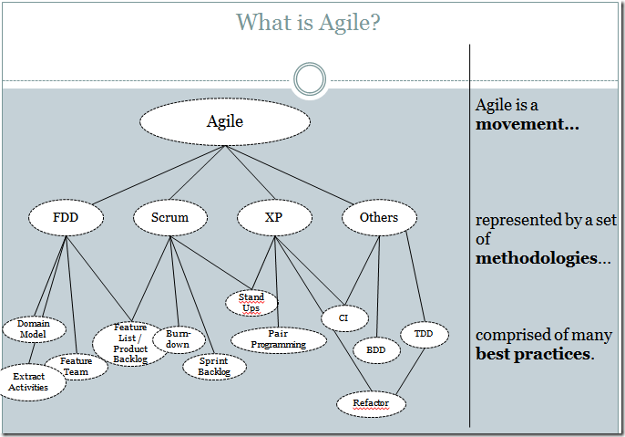
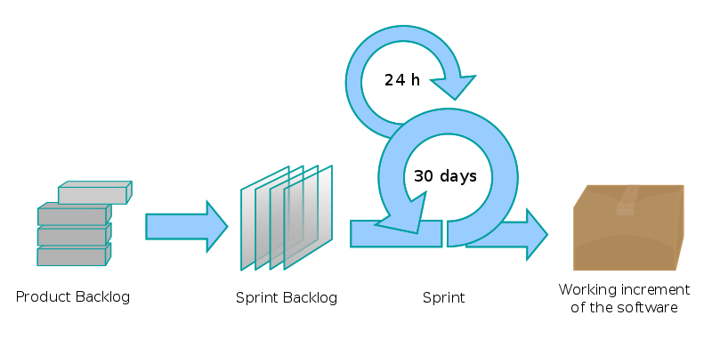
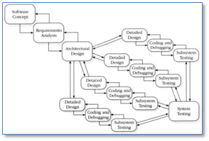

# Exort 项目管理说明
## 1 前言

按大作业要求我们应该采用敏捷开发的方式(具体为其中的Scrum方法)。
[推荐阅读](https://www.cnblogs.com/xinz/archive/2011/11/27/2265425.html)

> 敏捷 (Agile) 是一股思潮, 它包括了好几种软件开发的方法论 (methodology);
> 这些方法论又是建立在许多业界证明行之有效的最佳实践方法 (best practices) 上面的。
> [1](https://www.cnblogs.com/xinz/archive/2011/04/27/2031118.html)
> 

Scrum要求团队
- **Self-managing** 团队成员需要自主挑选任务，sprint结束后要总结不足提出改进，并自己能实施这些改进。
- **Self-organizing** 每个团队成员共同对项目负责，当其他人落后了需要帮助他改进。
- **Cross-functional** 团队成员要有全面的能力，包括设计、编码、测试等

编写这个文档的目的就是帮助团队达成上述这些很高的要求。

## 2 敏捷软件开发宣言

> 我们一直在实践中探寻更好的软件开发方法，身体力行的同时也帮助他人。
> 由此我们建立了如下价值观：
> - **个体和互动** 高于 **流程和工具**
> - **工作的软件** 高于 **详尽的文档**
> - **客户合作** 高于 **合同谈判**
> - **响应变化** 高于 **遵循计划**
>
> 也就是说，尽管右项有其价值，我们更重视左项的价值。

要注意《敏捷宣言》的最后一句不能忽视，更重视左项并不代表轻视右项。

## 3 软件开发流程

敏捷开发更注重团队成员之间的沟通，但依靠流程去指导我们前进的方向依然是必要的。

我们基于 **Scrum/Sprint** 开发流程，结合瀑布模型和测试驱动，提出适合我们的开发流程。

### 3.1 该项目 Waterfall 及各步骤产出

TODO: Waterfall 图

| 步骤 | 产出 |
|-|-|
| 需求分析 | 用例图 |
| 架构设计 | 架构图、技术选型 |
| (各个模块)接口设计 | 接口描述文档 |
| (各个模块)详细设计 | 类图、流程图、时序图等对模块具体实现的描述 |
| (各个模块)编写单元测试和集成测试 | 测试代码 |
| (各个模块)编写代码 | 实现代码 |
| (各个模块)构建、测试 | 可执行文件、测试报告 |
| (各个模块)发布 | 运行实例 |

### 3.2 应用 Scrum 后的流程

1. 按照依赖关系将 Waterfall 图中的当前能做的步骤加入 _Product Backlog_
2. ScrumMaster 或 _Product Backlog_ 创建者对其进行详细描述后加入 _Sprint backlog_
3. 项目成员认领 _Sprint backlog_ 并开始 sprint
4. 项目成员提交成果
5. 评审通过后完成 sprint
6. 项目成员完成一个步骤后，参照 Waterfall 图将下一步骤加入 _Product Backlog_
7. 重复 2~6，直至全部完成

## 4 规范/流程

我们的团队并没有过长期的共同合作，因此彼此之间没有心照不宣的约定，接下来详细罗列团队成员需要遵循的规范和流程。

### 4.1 软件开发流程

我们使用 **Github** 的 _Issue_, _Pull request_, _Project_ 功能管理开发流程。

看板页面位于 `Github项目主页 -> Projects标签 -> Iteration n`。

看板由五个栏目组成，并应用了以下自动移动规则：
- **Product Backlogs** 移入 _新的和重新打开的 Issue_
- **Sprint backlogs**
- **In Progress**
- **In Review** 移入 _新的和重新打开的 Pull request_
- **Done** 移入 _关闭的 Issue_ 和 _已合并的或已关闭的 Pull request_

(其中 **Done** 只是为了方便自动将卡片从其他栏目中移出)

`3.2节` 中的流程对应以下实际操作：(下面的叙述中，步骤对应一个 _Product Backlogs_, 任务对应一个 _Sprint Backlog_)
1. 按照依赖关系为 Waterfall 图中的当前能做的步骤各新建一个 _Issue_ (会自动加入到 **Product Backlogs**)
2. 1. 在 _Issue_ 页面中添加 _Comment_, 详细描述该步骤要做的事情以及期待的产出
   2. 在看板页面中将该 _Issue_ 从 **Product Backlogs** 移动到 **Sprint Backlogs**
3. 1. 项目成员浏览 **Sprint Backlogs**
   2. 将要认领的任务移动到 **In Progress**
   2. 点击卡片标题，在页面右侧点击 _Go to issue for details_
   3. 在 _Issue_ 页面中将自己添加到 _Assignees_
4. 项目成员完成任务后将成果(详见 `4.2 项目目录结构及各步骤产出`)提交(push)后，创建一个 _Pull request_ (详见 `4.3 代码集成`) (会自动加入到 **In Review**)，并引用对应任务的 _Issue_ ()
5. 评审员(项目成员)在 _Pull request_ 页面的 _File changed_ 标签中，点击 _Review changes_ 进行评审，并选择是否同意。
   1. 若全员同意，则合并该 _Pull request_ (会自动加入到 **Done**)，并关闭它引用的 _Issue_ (会自动加入到 **Done**)
   2. 若需要更改，则关闭该 _Pull request_ (会自动加入到 **Done**)，进行该任务的成员需要修改他的实现并重新提交，回到第 `4` 步
6. 一项步骤完成后，需要参照 Waterfall 图为下一个步骤新建 _Issue_ (会自动加入到 **Product Backlogs**)
7. 重复 2~6, 直至所有卡片都被移动到 **Done**

### 4.2 项目目录结构及各步骤产出

### 4.3 代码集成

### 4.4 评审

### 测试
### 部署
