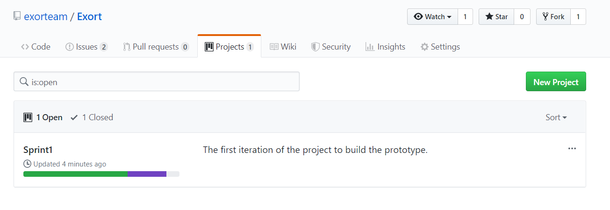
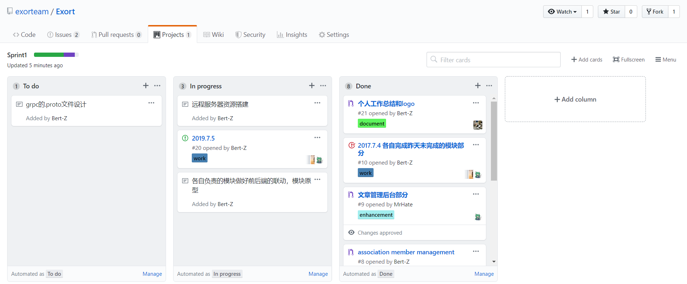
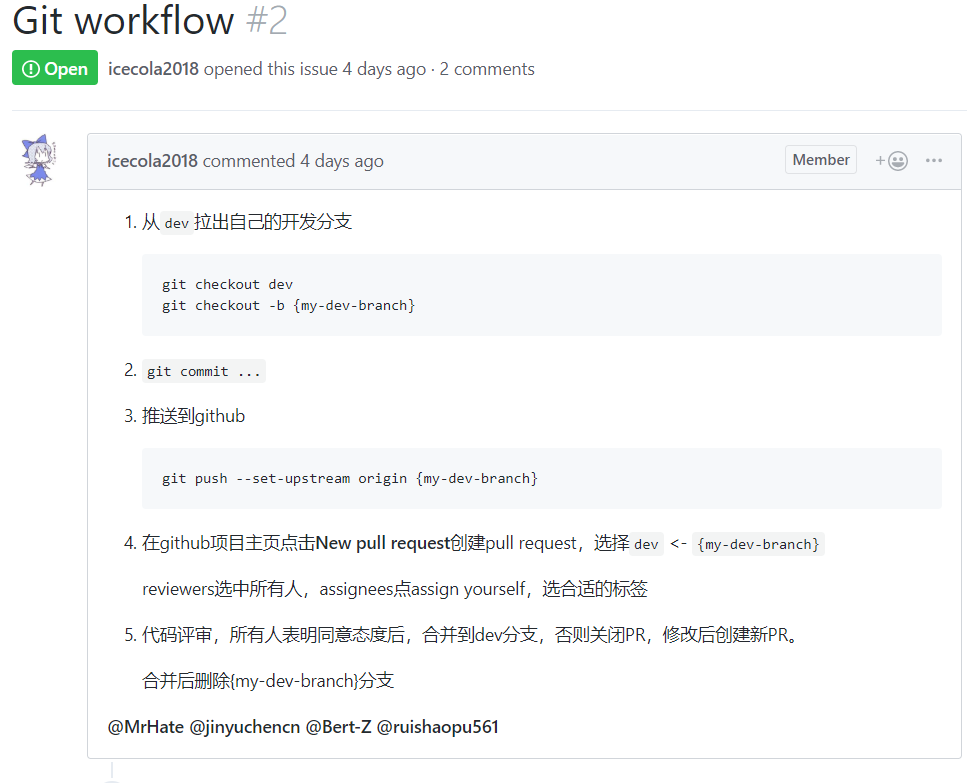

# 第一周工作总结

## 小组工作总结

### 第一次迭代计划完成部分：

- 数据库各模块数据结构与接口设计细化
- 基本完成用户管理、社团管理、社团成员管理、活动管理、文章管理的前端页面搭建
- 以上模块对应的后端，部分已经完成，但是未与微服务框架结合
- 远程服务器上CI/CD搭建
- 远程服务器k8s的搭建

### 未完成部分：

- 未与微服务框架结合
- 还有部分业务没有实现

------

### 团队建设中较好的部分：

#### 看板：

基于GitHub的issue、pull request和project很好的完成了看板建设，成员任务可以通过issue进行发布，完成则通过pr进行代码合并，并且会自动在看板上进行更新。

#### git使用规范：

小组有很好的工作流程，每个人的事先定好的git使用规范，大家基本都遵循着规范，没有冲突的发生。

### 不足的部分：

#### 敏捷开发流程规范问题：

对于敏捷开发的经验不熟悉，有时候不知道改怎么推动项目。

#### 代码规范问题：

虽然之前制定了编程代码规范，但是使用上仍存在不遵从的问题，还需要一个人来统一进行规范。

**以上提到的优点会一直继承，不足之处也会在下一周尽快改正。**

## 张万强

本周工作：

- 基于vue的前端框架完成基本的前端内容搭建，并且写了通用的模板组内成员使用。
- 和大家一起商讨了各模块的数据结构的部分，划分各个队员工作部分。
- 完成社团成员管理部分的前端界面，并且基本完成后端的内容部分。
- 完成gRPC与spring-boot的结合，并且解决了其中的一些依赖问题，写好了通用的模板。
- 完成基于Redis+Mysql+MongoDB的spring boot开发模板。

## 陈景宇
### Day 1
讨论了本周的工作计划，设计了Exort系统的社团信息与成员信息的数据结构
### Day 2
基本完成了Exort系统的详细设计，与其他组员一起讨论并整合了设计方案
### Day3
开始编写社团管理部分的页面
### Day4
基本完成了社团管理部分的前端代码
### Day5
开始编写社团管理部分的后台代码

## 邓公淯

1. 成功在远程服务器上部署MySQL
2. 完成部分“文章管理”模块后台实现
3. 成功在远程服务器上部署Kubernetes

## 芮召普
这周是小学期的第一周，根据我们的迭代计划，我们决定在前两天完成后端数据结构以及微服务模块的设计，
然后在之后根据这个具体的设计分模块实现前端和后端代码。

这个部分的工作整体由三人完成，因此我们根据工作量分配任务。我前期主要做了文章管理和活动管理，活动报名等相关的
数据库的设计；后几天主要完成活动管理这个大模块的前端和后端代码。这个模块涉及社团活动管理（创建，修改，发布等），
用户活动报名，审核报名等子模块。

## 沈小洲
### 主要完成的工作
1. 制定了git工作流程
2. 设计了权限管理和用户管理模块的接口
3. 编写了对应的前端Web页面

### 问题及接下来要做的工作
项目没有合理的软件开发流程，没有驱动力，因此也没有合理的规划。
考虑到组内的技术水平和开发水平不算是顶尖的，完全按照敏捷开发不可取，需要基于Scrum结合传统的开发流程设计一套适合我们团队的流程。

所以接下来要做的是
1. 基于Scrum设计并详细写出我们的软件开发流程，包括但不限于每个阶段的前置要求和产出要求。
2. 写出实践这套开发流程需要的实际行动。
3. 围绕软件开发具体的各个步骤，比如设计、编码、集成、测试、部署等，编写统一的规范。
4. 想办法动员所有人严格执行流程和规范。
