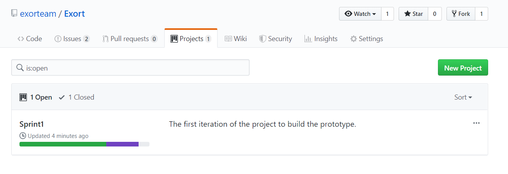
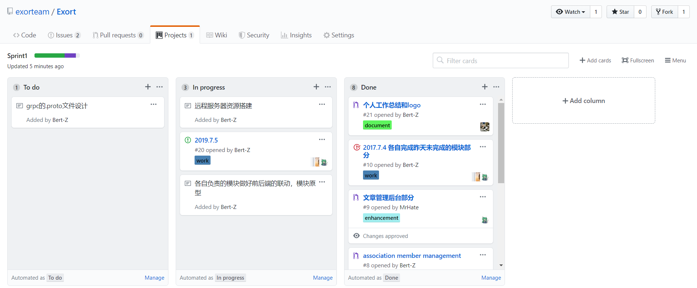
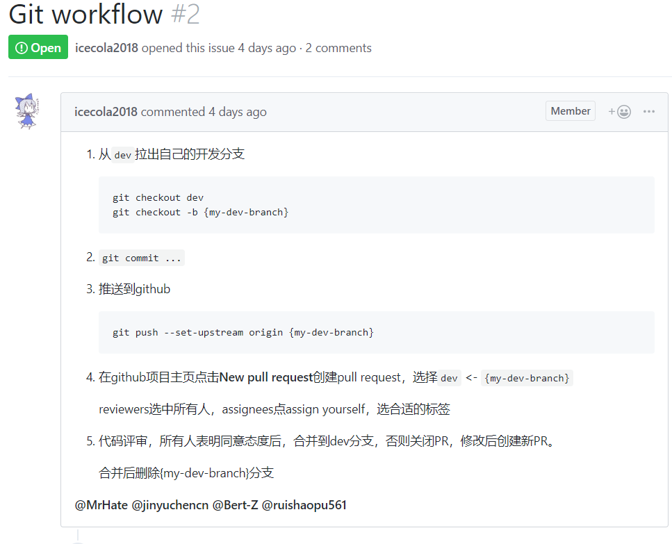

# 小组工作总结

### 第一次迭代计划完成部分：

- 数据库各模块数据结构与接口设计细化
- 基本完成用户管理、社团管理、社团成员管理、活动管理、文章管理的前端页面搭建
- 以上模块对应的后端，部分已经完成，但是未与微服务框架结合
- 远程服务器上CI/CD搭建
- 远程服务器k8s的搭建

### 未完成部分：

- 未与微服务框架结合
- 还有部分业务没有实现

------

### 团队建设中较好的部分：

#### 看板：

基于GitHub的issue、pull request和project很好的完成了看板建设，成员任务可以通过issue进行发布，完成则通过pr进行代码合并，并且会自动在看板上进行更新。

#### git使用规范：

小组有很好的工作流程，每个人的事先定好的git使用规范，大家基本都遵循着规范，没有冲突的发生。

### 不足的部分：

#### 敏捷开发流程规范问题：

对于敏捷开发的经验不熟悉，有时候不知道改怎么推动项目。

#### 代码规范问题：

虽然之前制定了编程代码规范，但是使用上仍存在不遵从的问题，还需要一个人来统一进行规范。

**以上提到的优点会一直继承，不足之处也会在下一周尽快改正。**
