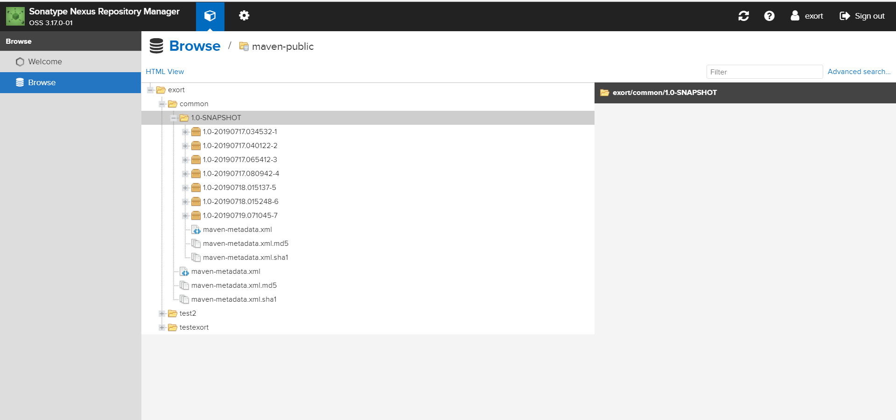

# 小组工作总结

### 第二次迭代计划完成部分：

- **社团管理**和**社团成员管理**模块数据结构和接口细化
- **社团管理**模块接口及各种文档书写与审核
- **社团成员管理**模块接口及各种文档书写与审核
- **社团管理**和**社团成员管理**模块后端代码
- 改进**权限管理**模块和**用户信息**模块
- 准备数据，完成对应模块单元测试及其他测试文件编写
- 部分完成了部署

### 未完成部分：

- 完全部署联动上线

------

### 团队建设中较好的部分：

#### 搭建了项目的公共类的远程仓库：

由于微服务需要经常调用其他微服务的类，但是本地无法直接调取，再加上不同微服务也存在向ResponseCode这样的共有格式的类，于是也提取出来到公共类仓库，方便统一格式与调用，不需要本地再写了。

### 不足的部分：

#### 代码规范性的问题：

代码开发完之后，发现由于在最开始的时候代码的规范规范做得不够完善，导致不同组员写的方法或者样式不一样，这部分需要再统一规范一下。

**以上提到的优点会一直继承，不足之处也会在下一周尽快改正。**