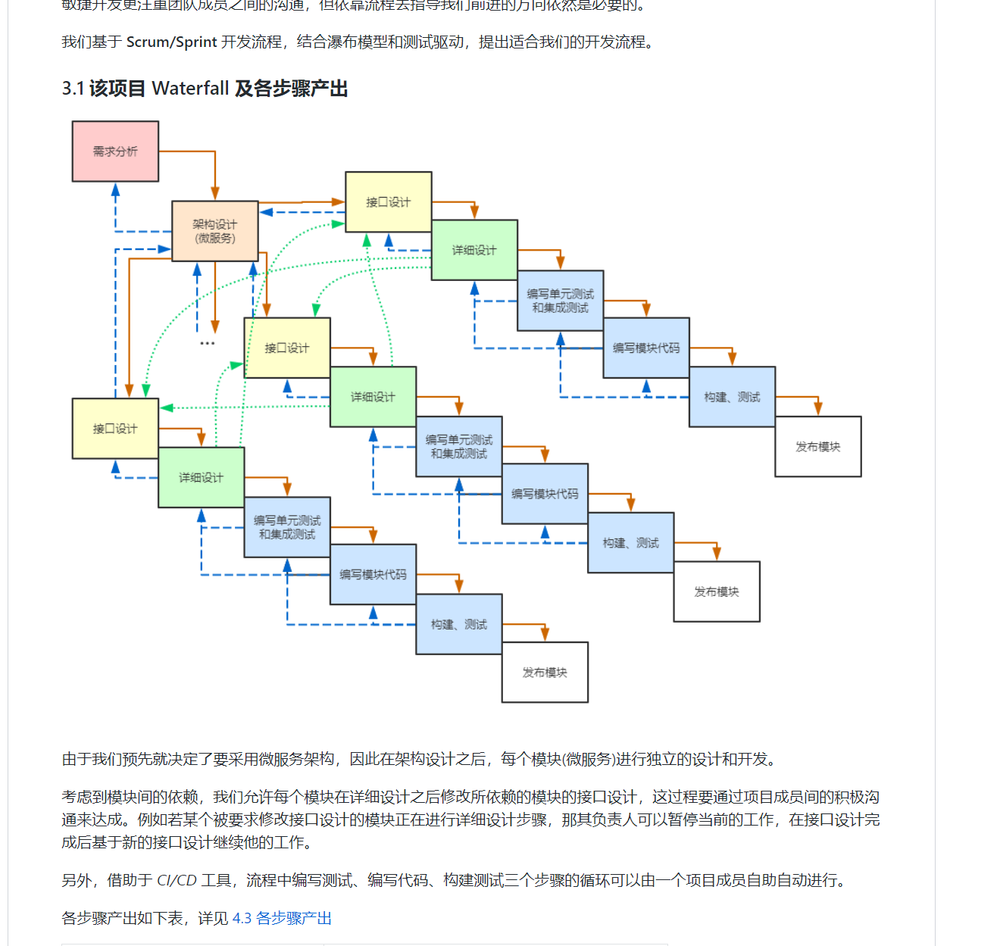

# 小组工作总结

### 第一次迭代计划完成部分：

- 基本完成用户管理和注册登录的前端页面搭建
- 主要模块对应模块接口文档
- 以上模块对应的后端，部分已经完成，与微服务框架结合
- 远程服务器上CI/CD搭建
- 远程服务器k8s的搭建

### 未完成部分：

- 无

------

### 团队建设中较好的部分：

#### 重新规范工作流程：

基于第一周的敏捷开发流程的问题，周末我们根据本组的工作需求，重新梳理了工作流程，之后严格按照现在的工作流程进行。

#### 组内学习机制

为了提高组内成员，让组员都能够在开发中提高，我们小组通过文档的形式来让各个组员都知道整个开发流程的细节。

#### 加强了审核流程：

为了避免代码风格不一致等问题，我们有了严格的审核流程，每次工作都要pr，并且其他组员要进行CodeReview。

#### 非常正规的接口文档：

我们组也严格按照k8s的http接口文档书写规范，有了非常正规且易于理解的接口文档。

### 不足的部分：

#### 开发进度上的问题：

由于为了熟悉敏捷开发的流程，并且书写更好的文档，我们这周代码开发的进度上有一点点滞后，不过大家熟悉了这套流程下周应该就会做得很好了。

**以上提到的优点会一直继承，不足之处也会在下一周尽快改正。**