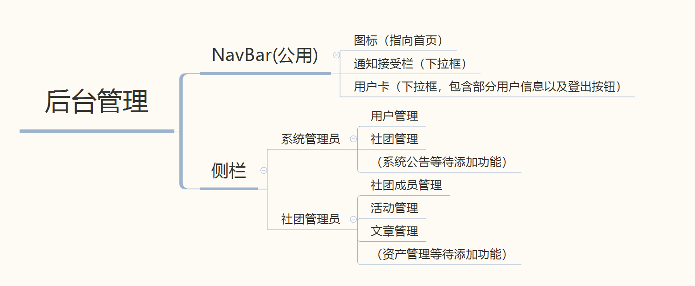
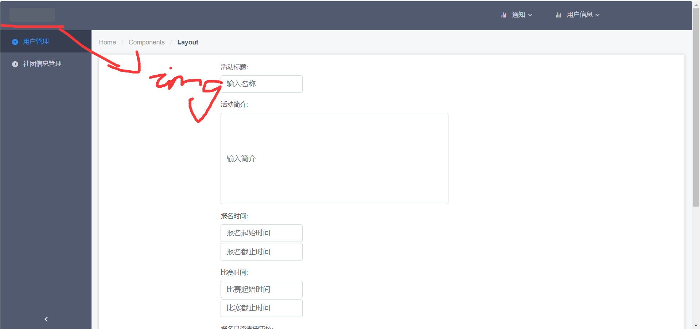

# 后台界面设计

## 概要

后台管理暂时只是**系统管理员**和**社团管理员**可以登陆进入。这里的设计是公用navbar，然后侧栏的情况根据用户角色的不同而发生变化，从而决定跳转到哪里。

## NavBar

目前导航栏大致是这样的，具体细节可以再调，包含三个要素：**图标**、**通知接收**、**用户信息**。

- **图标**导向管理首页
- **通知**为下拉框，可以查看接收到的通知
- **用户信息**也是下拉框，可以查看部分用户信息，进入用户界面，以及登出。

## SideBar

这个侧栏（可收起）就是区别用户的主要部分，具体可以根据第一张图内容来确定每一个Item。

侧栏内容后期也可根据模块增加来增长。